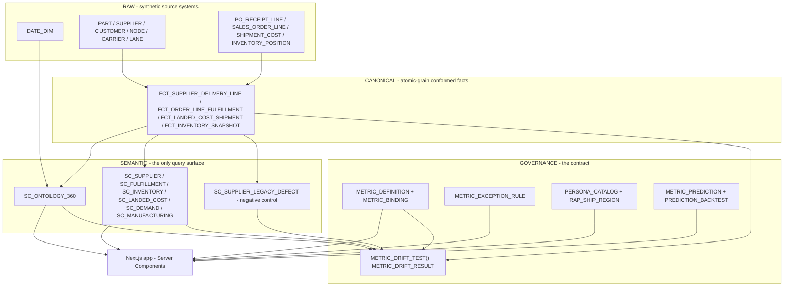

# Supply Chain Ontology

**Governed conversational analytics on Snowflake.** One set of canonical metric definitions,
expressed as native Snowflake semantic views, *proven* to resolve to the same number for planning,
procurement and logistics — and tested on a schedule rather than asserted in a README.

<p>
  
  
  
  
  
  
  
  
</p>

**Live demo:** https://sc-ontology-app.vercel.app (behind a demo sign-in gate)

Team 3M-ONTOLOGIST.

---

## The 60-second proof

Four claims, each checkable in one click rather than taken on faith:

| Judging focus | Claim | Check it |
|---|---|---|
| **Real World Relevance** | The ontology models exactly the chain named in the brief — Supplier → Part → Plant/DC → Shipment → Order → Customer — over the four canonical metrics named in the brief (OTD, fill rate, days of inventory, landed cost), plus IoT shipment telemetry. All four ontology elements the brief names are present, including **hierarchies**, and every declared rollup is *measured* rather than asserted. | [`/ontology`](https://sc-ontology-app.vercel.app/ontology) — 12 entities, 15 relationships, 7 hierarchies, 10 rollups proven against the source dimensions. |
| **Real World Relevance** | The cost of the divergence is stated in decisions, not decimal places: the legacy definition hands **12 suppliers** a pass they did not earn, inflating the compliant list by 22% — and **never** errs the other way, which is why it would survive indefinitely. | [`/consistency`](https://sc-ontology-app.vercel.app/consistency) — recomputed from the registry target on every page load. |
| **Technical Execution** | One metric definition resolves identically for Planning, Procurement and Logistics — and a deliberately broken negative control is kept deployed to prove the drift test can actually fail, not just pass. | [`/consistency`](https://sc-ontology-app.vercel.app/consistency) — `SC_SUPPLIER_LEGACY_DEFECT` reports **0.882631** against the correct **0.875824**, a measured 0.006807 spread the governed views do not repeat. |
| **Solution Completeness** | The conversational layer is **scored**, not asserted: 60 golden questions run over HTTP as their own personas, failures published rather than trimmed. One of them found a real broken-access-control bug. | [`/consistency`](https://sc-ontology-app.vercel.app/consistency) — `npm run eval` writes `GOVERNANCE.AGENT_EVAL_RUN`; `npm run parity` compares the Cortex Agent, the app, and the registry's canonical SQL. |

Full click-through: [`docs/DEMO_SCRIPT.md`](docs/DEMO_SCRIPT.md) (~5 minutes).

---

## Table of contents

- [The 60-second proof](#the-60-second-proof)
- [Why this exists](#why-this-exists)
- [What it does](#what-it-does)
- [Architecture](#architecture)
- [What the divergence actually costs](#what-the-divergence-actually-costs)
- [Repository layout](#repository-layout)
- [Quick start](#quick-start)
- [Building the database from scratch](#building-the-database-from-scratch)
- [Configuration](#configuration)
- [Pages](#pages)
- [The governance model](#the-governance-model)
- [Time, and the as-of rule](#time-and-the-as-of-rule)
- [Targets](#targets)
- [Authentication and caller's rights](#authentication-and-callers-rights)
- [The prediction layer](#the-prediction-layer)
- [The conversational layer](#the-conversational-layer)
- [The Ask module: conversational, charted, guarded](#the-ask-module-conversational-charted-guarded)
- [Design system](#design-system)
- [Testing and verification](#testing-and-verification)
- [Deployment](#deployment)
- [Operations runbook](#operations-runbook)
- [Troubleshooting](#troubleshooting)
- [Known limitations](#known-limitations)
- [Roadmap](#roadmap)
- [Contributing](#contributing)
- [Security](#security)
- [License](#license)
- [Acknowledgements](#acknowledgements)

---

## Why this exists

Supply chain data lives in ERP, logistics, supplier and IoT systems that each define "on-time"
slightly differently. The same question therefore returns different answers to different teams, and
the disagreement is usually discovered in a meeting rather than in a test.

The failure is rarely a broken join. It is more often arithmetic that looks reasonable in isolation:

```sql
-- One view read a source that was ALREADY aggregated to supplier-month:
SELECT supplier_id, DATE_TRUNC('month', receipt_date) AS period,
       AVG(IFF(receipt_date <= promised_date, 1, 0)) AS supplier_otd_pct
  FROM purchase_order GROUP BY 1, 2;

-- and then averaged those rates again:
SUPPLIER_OTD_PCT = AVG(supplier.otd)     -- an average of averages

-- A supplier with 3 receipts counted as much as one with 30,000.
-- The fix: define the metric once, over atomic purchase-order lines:
SUPPLIER_OTD_PCT = AVG(is_on_time)       -- 420,000 PO lines, proportionally weighted
```

That defect is measured, not hypothetical. `SEMANTIC.SC_SUPPLIER_LEGACY_DEFECT` still reproduces it
deliberately and currently reports **0.882631** against the correct **0.875824** — a spread of
**0.006807** on identical underlying rows. It is kept deployed so the drift control can be shown to
be *capable of failing* rather than merely passing, and the evidence is recorded in
`GOVERNANCE.METRIC_DRIFT_BASELINE` and `GOVERNANCE.METRIC_DRIFT_NEGATIVE_CONTROL`.

> A drift test that has only ever passed is indistinguishable from a drift test that is not running.

The stakes are ordinary, not exotic. **`ILLUSTRATIVE`** framing (same convention as the seeded
targets in `sql/03_targets.sql`): a 0.0068 spread on a metric near a 0.88 target is large enough to
flip which supplier gets escalated in an S&OP review, or which regional team is asked to explain a
miss it did not actually have. The cost of an ungoverned metric is not a wrong dashboard — it is a
meeting spent debating whose number is right instead of what to do about it.

---

## What it does

| | |
|---|---|
| **One definition, many consumers** | 14 governed metrics, each exposed through 2 semantic views. A dashboard figure and a conversational answer are the *same expression* evaluated by the same engine. |
| **Agreement is tested** | `GOVERNANCE.METRIC_DRIFT_TEST()` evaluates every binding against the metric's canonical atomic-grain SQL and records the spread. Zero spread on the last run. Runs daily at 06:00 UTC. |
| **Hierarchies are proven, not declared** | 7 drill paths, 17 levels. Every level is joined back to `INFORMATION_SCHEMA` and every rollup is measured against its source dimension, so a level that is not a true functional dependency fails the build. Two plausible rollups were measured and rejected. |
| **The divergence has a price tag** | `GOVERNANCE.V_DIVERGENCE_IMPACT` replays both definitions at supplier grain against the registry target: 12 suppliers cleared without earning it, 0 wrongly escalated. Recomputed on read, never stored. |
| **The conversational layer is scored** | `npm run eval` runs all 60 golden questions over HTTP as their own personas and records the result. Failures are published on `/consistency`, not trimmed. |
| **Personas are real roles** | Signing in selects a Snowflake role; queries run under it with secondary roles disabled, so grants and row access policies are enforced by the database, not the app. |
| **Numbers drill down to rows** | Every metric declares what an "exception row" is, so the rows shown under a number come from the same fact the number is defined over and therefore reconcile to it. |
| **Predictions are separated from measurements** | Forecasts live in their own registry, are excluded from the drift contract, and are never displayed without their backtested accuracy. |
| **The whole database is reproducible** | `node scripts/rebuild.mjs` builds all 6.1M rows, 9 semantic views and the governance layer from nothing in ~4.5 minutes. |

---

## Architecture



The load-bearing idea is the **arrow from `FCT` into `DRIFT`**. The drift test does not merely check
that the semantic views agree with each other — two views can agree while both being wrong. It
compares each view against an independent `CANONICAL_SQL` stored on the metric, computed directly
from the atomic fact.

### Ontology shape

`SC_ONTOLOGY_360` models **12 entities** — 5 conformed dimensions (`CALENDAR`, `PART`, `SUPPLIER`,
`CUSTOMER`, `NODE`) and 7 facts (`PURCHASE_ORDER`, `ORDER_FULFILLMENT`, `LANDED_COST`, `INVENTORY`,
`PRODUCTION_ORDER`, `FORECAST`, `SHIPMENT_TELEMETRY`) — joined by **15 relationships**.

Two absent edges are deliberate and load-bearing:

- **`LANDED_COST` has no direct edge to `PART` or `CALENDAR`.** It reaches both through
  `COST_TO_FULFILLMENT → ORDER_FULFILLMENT`. A direct edge would create a second join path, and every
  landed-cost metric would fail with a multi-path error.
- **`FORECAST` is not joined to `CALENDAR`.** Its period is a `'YYYY-MM'` string with no day-grain
  key, so it keeps its own `FORECAST_PERIOD` dimension.

### Hierarchies, and why they are the one part that is *checked*

The brief names four things an ontology must define: entities, relationships, **hierarchies**, and
canonical metrics. Three of those are derived from `INFORMATION_SCHEMA` and are therefore incapable
of drifting from the deployed views. Hierarchies cannot be: a Snowflake semantic view has no
hierarchy construct, so there is nothing to read one back from.

A declaration is unavoidable. An *unchecked* declaration is not, and this is what that distinction
was worth: `/ontology` previously rendered a hard-coded array in which three of the level names —
`SUPPLIER`, `NODE`, `CUSTOMER` — were **not dimensions of the view at all**. The real names are
`SUPPLIER_NAME`, `NODE_NAME` and `CUSTOMER_NAME`. Nothing failed. The page simply described a drill
path that did not exist.

`sql/12_ontology_hierarchy.sql` replaces it with a declaration plus two controls:

1. **Resolution.** Every level is joined to `INFORMATION_SCHEMA.SEMANTIC_DIMENSIONS`, so a level
   naming a dimension the view does not declare is visibly unresolved.
2. **Rollup.** Every parent/child pair is *measured* against the conformed dimension it is sourced
   from. A level qualifies only if each child value maps to exactly one parent.

Rule 2 is not decoration either. Two rollups that look obviously correct are false in this data:

| Proposed rollup | Violations | Why |
|---|---|---|
| `SUPPLIER_GROUP → SUPPLIER_REGION` | 6 | Commodity groups are managed across regions. |
| `CUSTOMER_SEGMENT → CUSTOMER_REGION` | 4 | Go-to-market segments are cross-regional by construction. |

Stacking either into a chain would have produced a drill path that double counts, so they are
declared as their own two-level hierarchies instead. The result is 7 hierarchies over 17 levels,
with all 10 rollups measured:

```
PRODUCT    material → product_family → business_segment   2000 → 8 → 4, 0 split parents
SOURCING   supplier_name → supplier_region                 300 → 4, 0 split parents
COMMODITY  supplier_name → supplier_group                  300 → 6, 0 split parents
NETWORK    node_name → node_region                          24 → 4, 0 split parents
ACCOUNT    customer_name → customer_segment                1200 → 4, 0 split parents
SALES_GEO  customer_name → customer_region                 1200 → 4, 0 split parents
TIME       cal_date → cal_month → cal_quarter → cal_year   1096 → 36 → 12 → 3, 0 split parents
```

`sql/90` re-runs `VALIDATE_ONTOLOGY_HIERARCHY()` during verification, so a later change to a
semantic view is caught by the build rather than by somebody noticing.

---

## What the divergence actually costs

The negative control records a spread of `0.006807` on supplier on-time delivery. On its own that is
a number, not a consequence — two thirds of a percentage point sounds like rounding, and a steward
is entitled to ask why anyone should care.

`GOVERNANCE.V_DIVERGENCE_IMPACT` answers that by measurement. Both definitions are replayed at
supplier grain over the same 420,000 receipt lines and scored against the registry target, because
nobody acts on the number — they act on the verdict:

| | |
|---|---|
| Suppliers genuinely at the 0.90 target | **54** of 300 |
| Suppliers the legacy definition reports at target | **66** |
| Cleared without earning it (false pass) | **12** |
| Wrongly escalated (false fail) | **0** |
| Compliant list inflated by | **22%** |

The last row is the one that matters, and it is the reason this class of defect survives. A metric
that wrongly *escalates* a supplier is found within a week: the supplier disputes it and somebody
rechecks the arithmetic. A metric that wrongly *clears* a supplier generates no complaint from
anyone. **The cost of an ungoverned metric is not a wrong dashboard — it is a review that never
happens.**

Nothing here is stored. The target is read from `METRIC_DEFINITION` and both definitions are
replayed on every read, so changing the target recomputes the verdict rather than stranding a
sentence. `sql/90` asserts both halves of the claim, including that the error is still
one-directional — if a future data change ever produces a false fail, the build fails rather than
leaving a stale paragraph on the page.

> **`ILLUSTRATIVE` framing, same convention as `sql/03_targets.sql`.** The target is illustrative and
> the data is synthetic. The *arithmetic* is not: these counts come from the same atomic fact the
> governed metric is defined over.


---

## Repository layout

```
.
├── app/                     Next.js App Router — pages and API routes
│   ├── api/ask/             conversational resolution, persona-scoped execution
│   ├── api/consistency/     one metric executed as every persona
│   ├── api/drilldown/       exception rows behind a number
│   └── …                    /, /operations, /metrics, /ontology, /consistency, /outlook, /ask
├── components/              presentational components (charts, tiles, brand mark)
├── lib/
│   ├── sc.ts                governed data access — all semantic-view and registry reads
│   ├── snowflake.ts         connection pooling, SPCS token / password / TOML auth
│   ├── persona.ts           per-role connection pools, USE ROLE + secondary roles NONE
│   ├── period.ts            reporting period and as-of resolution
│   └── auth.ts, session.ts  the demo sign-in gate
├── sql/                     every DDL statement, numbered in apply order  ← see 00_README.md
├── scripts/
│   ├── rebuild.mjs          builds the entire database from nothing
│   ├── eval.mjs             scores the 60 golden questions over HTTP, one persona each
│   ├── parity.mjs           Cortex Agent vs application vs CANONICAL_SQL
│   ├── sf.mjs               shared Snowflake connection for the scripts that are not the rebuild
│   ├── sq.mjs               run one statement or one file from the CLI, for inspection
│   ├── smoke.mjs            21 end-to-end checks against a running instance
│   ├── smoke-outlook.mjs    11 checks on the prediction page
│   ├── smoke-chat.mjs       25 checks on the conversational Ask layer, latency asserted
│   ├── probe-asof.mjs       10 reporting-period edge cases
│   └── set-vercel-env.ps1   pushes Snowflake settings to Vercel without printing the password
├── __tests__/               vitest — mocks lib/snowflake
├── app.yml                  Snowflake App Runtime manifest (version: 2)
└── AGENTS.md                APPLICATION SERVICE operations reference
```

---

## Quick start

### Prerequisites

| Requirement | Notes |
|---|---|
| **Node.js 20+** | Next.js 16 requirement. `node -v` |
| **A Snowflake account** | Needs `ACCOUNTADMIN` for the initial build (it creates roles, a row access policy, a notification integration and tasks). |
| **Snowflake CLI** (`snow`) | Used for ad-hoc SQL. `pip install snowflake-cli` |
| **A warehouse named `COMPUTE_WH`** | Or override with `SNOWFLAKE_WAREHOUSE`. An X-Small is sufficient. |
| **Cortex enabled** | `/ask` uses `AI_COMPLETE`; `/outlook` uses `SNOWFLAKE.ML.FORECAST` and `ANOMALY_DETECTION`. |

### 1. Configure a Snowflake connection

```bash
snow connection add          # writes ~/.snowflake/connections.toml
snow connection test
```

### 2. Install and build the database

```bash
npm install
node scripts/rebuild.mjs     # ~4.5 min: 6.1M rows, 9 semantic views, governance layer
```

### 3. Configure the sign-in gate

```bash
cp .env.example .env.local
```

Then set both variables — **without both, every route redirects to `/login`**:

```bash
AUTH_SECRET=$(node -e "console.log(require('crypto').randomBytes(32).toString('base64url'))")
DEMO_USERS=planner:<pw>:SC_PLANNER;buyer:<pw>:SC_PROCUREMENT;logistics:<pw>:SC_LOGISTICS;logistics-eu:<pw>:SC_LOGISTICS_EU
```

### 4. Run

```bash
npm run dev                  # http://localhost:3000
```

### 5. Verify

```bash
npm test                     # 163 / 169 (see Known limitations)
npm run smoke                # 21 end-to-end checks — needs the dev server running
```

---

## Building the database from scratch

Everything in Snowflake is reproducible from `sql/`. Nothing is to be created by hand.

```bash
node scripts/rebuild.mjs                 # everything, in order
node scripts/rebuild.mjs --dry-run       # print the plan, execute nothing
node scripts/rebuild.mjs --only 00c      # one file
node scripts/rebuild.mjs --from 07b      # resume from a file onwards
node scripts/rebuild.mjs --verify        # only the 90-92 verification files
```

### Why there is a custom runner

`snow sql -f` splits a file on semicolons **client-side**, which corrupts every `DECLARE … END` body
in `sql/` — the `METRIC_DRIFT_TEST` procedure and the `GET_DDL` splice blocks in `01` and `07`. The
runner submits each file whole with `MULTI_STATEMENT_COUNT` set, so Snowflake's own parser finds the
statement boundaries. Use the runner, not `snow sql`, for `00f`, `01` and `07`.

### Apply order

| Order | File | Builds |
|---|---|---|
| 1 | `00a_foundation.sql` | database, 6 schemas, 5 persona roles + 3 owner roles, grants |
| 2 | `00b_raw_dimensions.sql` | `DATE_DIM`, `PART`, `SUPPLIER`, `CUSTOMER`, `NODE`, `CARRIER`, `LANE` |
| 3 | `00c_raw_transactions.sql` | the 6 transactional sources, full scale (slowest step) |
| 4 | `00d_canonical.sql` | the 5 `CANONICAL.FCT_*` atomic facts |
| 5 | `00e_semantic.sql` | the 8 base semantic views — **must precede `01`** |
| 6 | `00f_governance.sql` | registry, drift procedure, ontology views, personas, row access policy |
| 7 | `01_calendar_dimension.sql` | splices the conformed `CALENDAR` dimension into `SC_ONTOLOGY_360` |
| 8 | `02_as_of_rule.sql` | adds the as-of and target columns, sets the scope per metric |
| 9 | `03_targets.sql` | seeds illustrative targets, records why six metrics have none |
| 10 | `04_drift_schedule.sql` | daily drift task, alert log, alert |
| 11 | `05_exception_rules.sql` | what an exception row is, per metric |
| 12 | `06_drift_notification.sql` | email integration and the negative-control binding |
| 13 | `07_verified_queries.sql` | documents amending verified queries on a **live** view; adds none |
| 14 | `07b_prediction_objects.sql` | `PREDICT_TARGET_BREACH()`, `V_METRIC_OUTLOOK`, `SC_OUTLOOK` + 2 verified queries |
| 15 | `08_prediction_layer.sql` | `SNOWFLAKE.ML` forecast and anomaly models (~112 s) |
| 16 | `08b_persist_forecast.sql` | persists and backtests the volume forecast (~88 s) |
| 17 | `09_agent_eval.sql` | the 60-question evaluation set, with 3 self-assertions |
| 18 | `10_agent.sql` | `SC_ONTOLOGIST_AGENT` and its 9 tools |
| 19 | `10b_geospatial_reference.sql` | geocoded network nodes, region-hub lane geometry and chokepoint reference data |
| 20 | `10c_network_risk_scenarios.sql` | simulated network-risk scenario and lane-level impact assumptions |
| 21 | `11_iot_telemetry.sql` | `FCT_SHIPMENT_TELEMETRY`, `SC_TELEMETRY`, the `temp_excursion_rate` metric — closes the IoT gap named in the brief |
| 22 | `90_verify_base.sql` | splice anchors, registry shape, verified-query counts, agent exists, **the drift gate** |
| 23 | `91_verify_personas.sql` | proves the EU row scope actually filters |
| 24 | `92_verify_counts.sql` | row counts, snapshot cardinality, data shape |
| 25 | `93_verify_verified_queries.sql` | **executes** all 39 verified queries |

`sql/00_README.md` carries the full rationale. Two ordering facts matter:

> **`01` is not idempotent.** It splices `CALENDAR` into whatever `SC_ONTOLOGY_360` currently is, so
> running it twice fails with `duplicate alias 'CALENDAR'`. It is only safe immediately after `00e`.
> The runner therefore **auto-prepends `00e`** to any plan containing `01`.

> **Never run `00e` after `01` by hand.** It reverts the view to 10 entities, silently removing
> `calendar.cal_date` and `calendar.is_future` that `lib/period.ts` filters on — breaking every
> period-scoped page with no error at build time.

### Data volumes

| Object | Rows | Event date |
|---|---:|---|
| `RAW.SALES_ORDER_LINE` → `FCT_ORDER_LINE_FULFILLMENT` | 1,500,000 | `DELIVERY_DATE` |
| `RAW.SHIPMENT_COST` → `FCT_LANDED_COST_SHIPMENT` | 1,480,499 | `DELIVERY_DATE` |
| `RAW.PO_RECEIPT_LINE` → `FCT_SUPPLIER_DELIVERY_LINE` | 420,000 | `RECEIPT_DATE` |
| `FCT_REQUISITION_LINE` | 420,000 | `REQUISITION_DATE` |
| `RAW.PRODUCTION_ORDER` | 240,000 | `COMPLETED_DATE` |
| `RAW.INVENTORY_POSITION` → `FCT_INVENTORY_SNAPSHOT` | 137,088 | `SNAPSHOT_DATE` (24 month-ends) |
| `RAW.DEMAND_FORECAST` | 52,000 | `PERIOD` (`YYYY-MM`) |

The data is **synthetic and deterministic**: every derived attribute is a function of the row's
sequence number via `ABS(HASH(seq, 'salt'))`, never `RANDOM()`. A rebuild is byte-reproducible, which
matters because `RANDOM()` with a seed is only reproducible if row order is — and row order under a
parallel `GENERATOR` is not.

Three distribution choices are load-bearing rather than cosmetic, and each is documented at the point
of use in `sql/00c_raw_transactions.sql`:

- **~2.8% of receipt and delivery rows are future-dated** (not the 8.4% a uniform spread over the
  range would give), so the as-of rule has something real to exclude without making recent month
  read as catastrophic.
- **Days-of-inventory cover is a squared draw**, not uniform. A uniform 5–59 gave the right mean of
  32 but capped below 60, so the ">60 days" exception rule matched 0 of 137,088 rows and that
  drill-down was permanently empty.
- **The EU on-time premium is 1.5pp**, not the 0.2pp originally intended. Measured over one month
  (~14k EU lines, standard error ~0.3pp) a 0.2pp design produced a 0.01pp observed gap whose sign was
  not stable — an assertion that can pass or fail on sampling noise proves nothing about row scoping.

### Why this generalizes beyond synthetic data

The data is synthetic; the governance layer that sits on top of it is not data-shaped, it's
schema-shaped. `GOVERNANCE.METRIC_DEFINITION` / `METRIC_BINDING` / `METRIC_DRIFT_TEST()` reference
semantic-view columns and an independent `CANONICAL_SQL`, not any property of the synthetic rows
themselves. Pointing `CANONICAL.FCT_*` at real ERP, WMS or IoT extracts instead of `RAW.*` requires
new source-to-canonical conformance mappings — the same kind of mapping `sql/00d_canonical.sql`
already performs for six synthetic sources — not a redesign of the registry, the drift contract, or
the row-access model. The hard part this project solves (one governed definition, tested agreement,
real per-persona row scoping) is exactly the part that does not change when the source data does.

---

## Configuration

### Application environment variables

| Variable | Required | Default | Purpose |
|---|---|---|---|
| `AUTH_SECRET` | **yes** | — | Signs the session cookie. 32+ random chars. Rotating it invalidates every session immediately. |
| `DEMO_USERS` | **yes** | — | `user:password:ROLE` triples, `;`-separated. The role is the Snowflake role queries run as. |
| `SNOWFLAKE_ACCOUNT` | for password auth | — | Account identifier. |
| `SNOWFLAKE_USER` | for password auth | — | Service user. |
| `SNOWFLAKE_PASSWORD` | for password auth | — | Service user password. |
| `SNOWFLAKE_ROLE` | no | `ACCOUNTADMIN` | Base role for owner's-rights metadata reads. `SC_ONTOLOGY_STEWARD` is sufficient. |
| `SNOWFLAKE_WAREHOUSE` | no | `COMPUTE_WH` | Query warehouse. |
| `SNOWFLAKE_CONNECTION_NAME` | no | file default | Selects a connection from `connections.toml` in local dev. |
| `CALLERS_RIGHTS` | no | off | Runs governed metric reads with the caller's own grants. SPCS only. |
| `SNOWFLAKE_SERVICE_AUTH` | set by `app.yml` | — | `spcs` tells the app the platform authenticates callers, so the demo gate is skipped. |

### Snowflake authentication precedence

`lib/snowflake.ts` auto-detects, in order:

1. **SPCS token** — `/snowflake/session/token`, re-read on every call (it rotates).
2. **`SNOWFLAKE_USER` + `SNOWFLAKE_PASSWORD`** — password auth, used on Vercel.
3. **`~/.snowflake/connections.toml`** or `config.toml` — zero-config local development.

---

## Pages

| Route | What it shows |
|---|---|
| `/` | Headline metrics for the selected period with target, prior-period and year-on-year deltas, a 12-month trend, drill-down to the offending rows, and the open commitment the as-of rule excluded. |
| `/operations` | Cross-domain operational tables by product family, supplier region, carrier and destination. |
| `/metrics` | The registry: definition, numerator, denominator, grain, owner, target, reporting scope, and the drift-test track record. |
| `/ontology` | Entities, relationships and hierarchies read live from `INFORMATION_SCHEMA` on the deployed view, so the diagram cannot drift from what is queried. Each hierarchy level shows whether it resolves and whether its rollup was measured as a true functional dependency. |
| `/consistency` | One metric executed as each persona role side by side; the recorded pre-remediation divergence and the negative control; **what that divergence costs in misclassified suppliers**; the **scored** 60-question evaluation run with its failures published; and the recorded Cortex Agent / application parity. |
| `/outlook` | Governed predictions, each shown with the accuracy it achieved on held-out months. |
| `/ask` | A question resolved to registered metrics, executed under the signed-in persona's role, with provenance and drill-down on every answer. |
| `/network-risk` | Geospatial network topology, maritime chokepoints and simulated lane-level disruption scenarios, so the ontology drives an operational read, not only a report. |

The period control writes to the URL, so a period-scoped view is a shareable link and every page
stays a Server Component. It offers six presets, an explicit **Custom range**, and an **as-of date**
for reviewing the app as it looked on a past day.

It is rendered per page rather than in the global header on purpose: `/metrics`, `/ontology` and
`/consistency` are deliberately all-history — a definition and its drift status have no reporting
period — and a header control would imply it affected them too.

Every page section streams independently and fails independently: a slow freight query cannot blank
the ontology diagram, and a failing section names itself instead of just turning red.

---

## The governance model

Four rules, enforced rather than documented:

1. **Every number comes from a semantic view.** There is no metric arithmetic in the application.
   Pages and API routes issue `SELECT … FROM SEMANTIC_VIEW(…)` and render the result.
2. **A metric that is not registered cannot be asked about.** `GOVERNANCE.METRIC_DEFINITION` is the
   catalogue. The conversational resolver may only choose ids from it, its output is validated
   against it, and it never writes SQL.
3. **Agreement is tested, not asserted.** `METRIC_DRIFT_TEST()` evaluates every metric through every
   view bound to it, compares each against the canonical atomic-grain fact, and records the spread.
4. **The persona is a real Snowflake role.** Queries execute under it with secondary roles disabled,
   so grants and row access policies are enforced by the database.

### Key objects

| Object | Purpose |
|---|---|
| `SEMANTIC.SC_ONTOLOGY_360` | The ontology as one semantic view: 12 entities, 15 relationships, cross-domain metrics. The only view the app queries directly. |
| `SEMANTIC.SC_*` | Domain-scoped subsets. Metric expressions are *identical* to their `SC_ONTOLOGY_360` twins; the drift test asserts that on every run. |
| `SEMANTIC.SC_SUPPLIER_LEGACY_DEFECT` | The deliberately defective negative control. **Never fix it.** |
| `GOVERNANCE.METRIC_DEFINITION` | Canonical definition, numerator, denominator, grain, owner, target, thresholds, as-of scope, and the independent `CANONICAL_SQL`. |
| `GOVERNANCE.METRIC_BINDING` | Which views serve which metric. The drift test walks this. 28 rows. |
| `GOVERNANCE.METRIC_DRIFT_RESULT` | One row per metric per run, keyed by `RUN_ID` — never by a time window. |
| `GOVERNANCE.METRIC_EXCEPTION_RULE` | What an exception row is, per metric. Drives the drill-down. |
| `GOVERNANCE.ONTOLOGY_ENTITY` / `ONTOLOGY_RELATIONSHIP` | **Views** over `INFORMATION_SCHEMA`, so the catalogue is structurally incapable of drifting from the deployed views. |
| `GOVERNANCE.PERSONA_CATALOG` / `PERSONA_VIEW_ACCESS` / `PERSONA_REGION_SCOPE` | Persona roles, their view grants, and their row scope. |
| `GOVERNANCE.RAP_SHIP_REGION` (row access policy) | Restricts outbound rows by destination region, driven by the mapping table rather than a hardcoded role name. |
| `GOVERNANCE.METRIC_DRIFT_TEST_DAILY` (task) | Runs the drift test at 06:00 UTC, serverless X-Small. |
| `GOVERNANCE.METRIC_DRIFT_FAILED` (alert) | Hourly; logs any new failing run and emails via `SC_GOVERNANCE_EMAIL`. |

### The trust boundary

`METRIC_EXCEPTION_RULE.exception_where` and `.order_by` are interpolated into SQL by the drill-down
route **without escaping**. That is safe only because `GOVERNANCE` is admin-owned configuration at
the same trust level as the semantic view definitions, and no application role holds `INSERT` or
`UPDATE` on it. Everything arriving from a request is bound or validated against
`INFORMATION_SCHEMA` instead.

**Do not grant write access on `GOVERNANCE` to an application role.**

---

## Time, and the as-of rule

The warehouse contains data about two months into the future — promised receipts and planned
deliveries. Roughly **2.8%** of receipt and delivery rows are dated after today (currently 41,125
future order lines and 11,582 future PO lines). Unfiltered, that is not a rounding error: it makes
supplier OTD for the latest month read `0.0000`, because none of those receipts have happened yet.

So each metric records how it must be scoped:

| `as_of_scope` | Meaning | Applied as |
|---|---|---|
| `REALIZED` | An event that has already happened. | `WHERE calendar.is_future = 0`, plus the period range. |
| `SNAPSHOT` | A balance at a point in time. Not additive across periods. | Pinned to the latest snapshot in range, **not** aggregated over it. |

The distinction matters: summing on-hand quantity across twelve monthly snapshots would count the
same physical stock twelve times. The application splits a mixed query into one per scope and joins
the results, rather than applying one filter to both.

**Excluded rows are not hidden.** The overview carries an *Open commitment* tile showing exactly what
the as-of rule set aside, labelled as promised activity rather than performance. Dropping tens of
thousands of rows silently would be its own kind of dishonesty.

**The drift test deliberately stays unfiltered and all-history.** It tests whether two views agree on
a *definition*, which is a different question from what a metric reads this month. Narrowing its
scope would weaken it.

---

## Targets

`DIRECTION` (`higher` / `lower` / `to_zero`) says which way is good; `TARGET_VALUE` says what good is.
**Eight of the fourteen** metrics carry one.

The other six — freight cost, freight invoiced, freight bill variance, landed cost, inventory value,
PPV — are **deliberately untargeted**, and `TARGET_SOURCE` records why: they are absolute dollar
amounts that scale with volume and with the length of the reporting period, so a fixed threshold
would turn "we shipped more this quarter" into a red light. Normalise them first (per unit, per
shipment, as a share of accrued freight) and register that as its own metric.

> ⚠️ The seeded targets are marked `ILLUSTRATIVE` in `TARGET_SOURCE`. **They are not committed 3M
> targets.** Replace them before anyone makes a decision on these screens.

Target state and drift status render as two separate pills, deliberately. They answer different
questions — *is the number acceptable* versus *do the views agree on the definition* — and a metric
that is green on drift and red against target is the normal, healthy case for a business that is
missing a goal while measuring it correctly.

---

## Authentication and caller's rights

The app is reachable on a public URL with owner's-rights Snowflake access, so it is gated. The gate
**fails closed**: without `AUTH_SECRET` and `DEMO_USERS`, every route redirects to `/login`.

The role in each `DEMO_USERS` triple is not decoration. Signing in as `logistics-eu` really does
return EU-scoped rows — from the same metric definition. The server takes the persona from the
session, never from the request body; asking as another persona returns **403**.

This is a **demonstration gate**, not an identity provider: a fixed account list, a signed cookie, no
user store. For production, front the app with SSO or run it in Snowflake App Runtime, where the
platform authenticates callers and the gate is skipped automatically.

### Caller's rights

Governed **metric reads** can additionally run with the calling user's own Snowflake grants, so row
access policies and masking apply to them. **Off by default**, enabled with `CALLERS_RIGHTS=1`.

Off by default on purpose rather than inferred: today only the five `SC_*` persona roles hold
`SELECT` on the semantic views, so enabling it before those grants exist turns every page into an
authorisation error. It has no effect outside SPCS, where there is no caller identity to run as.

Metadata reads — registry, ontology, persona catalogue — stay owner's-rights either way. They are
shared reference data, and requiring grants on `GOVERNANCE` would make pages fail for reasons
unrelated to the data being protected.

The persona comparison on `/consistency` and the persona-scoped execution in `/api/ask` must run as a
*named* role rather than as the caller, so they always use `lib/persona.ts`, which pools connections
**per role** — never shared between roles, because session role is mutable state and a leaked role is
worse than a slow connect.

---

## The prediction layer

Before building a forecasting layer, the question was whether the data can carry one. Mostly it
cannot, and that finding shaped the design more than any preference did.

**The service ratios are stationary.** Aggregate on-time delivery holds inside a narrow band for 23
consecutive months. Per product family, month-to-month standard deviation is 0.2–0.4 percentage
points, while the spread *between* families is ~4.9 points — a ratio of roughly 6:1. Carriers show no
dispersion at all (0.0008).

Two consequences:

1. Forecasting the *level* of these metrics returns a flat line at the historical mean. The backtest
   proves it — predicting the mean scores ~99.7% accuracy on six held-out months. An
   excellent-looking number that demonstrates nothing, which is exactly the vanity metric this
   project exists to prevent. Every `TARGET_BREACH` row therefore records
   `beats_benchmark = FALSE` against its own trailing-mean benchmark.
2. So the layer answers the question the data *does* support — **is the governed target reachable**.

| Method | What it does | Why it fits |
|---|---|---|
| `TARGET_BREACH` | How many standard deviations of ordinary month-to-month variation separate current performance from the target, per family | Cross-sectional spread is real and each family holds its level tightly, so the call is confident |
| `ANOMALY` | `SNOWFLAKE.ML.ANOMALY_DETECTION` on the ratio metrics | The *correct* tool for a flat series: because each family holds ±0.3pp, a genuine shift is highly detectable |
| `ML_FORECAST` | `SNOWFLAKE.ML.FORECAST` on order-line volume | Volume carries a real level plus a days-in-month effect. Measured: **99.36% accuracy vs a 98.16% trailing-mean benchmark — it genuinely beats it** |

The headline result is worth stating plainly: the 95% on-time-delivery target sits **16 to 34
standard deviations** above every family's realized performance. That is not a stretch target — on
current process capability it is unreachable, and the honest reading is that either the process or
the target has to change. Fill rate is the opposite case, where the target is close enough that the
method discriminates.

Synthetic trend and seasonality were **deliberately not injected** to make the forecasting demo
better. It would have altered the dataset the drift baseline and every governed metric depend on.

### A prediction is not a measurement

Enforced structurally rather than by convention:

- predictions live in `GOVERNANCE.METRIC_PREDICTION` and never enter a realized aggregate;
- they are **excluded from the drift test** — nothing in `METRIC_BINDING` references `SC_OUTLOOK`, so
  the test cannot reach them. Compared against the canonical fact a forecast would fail by design,
  which would say nothing about its quality;
- the volume forecast is filed under `metric_id = 'order_line_volume'`, which is **deliberately not
  in `METRIC_DEFINITION`** — registering a forecast as a governed metric would place it inside the
  realized-metric contract;
- accuracy is **measured, not asserted**: `08b` trains a second model on a truncated series and scores
  it against six withheld months;
- `/outlook` shows each prediction beside its own backtested accuracy, because a forecast that cannot
  show its track record is an opinion.

```sql
CALL SUPPLY_CHAIN.GOVERNANCE.PREDICT_TARGET_BREACH();
SELECT * FROM SUPPLY_CHAIN.GOVERNANCE.V_METRIC_OUTLOOK;
SELECT * FROM SUPPLY_CHAIN.GOVERNANCE.PREDICTION_BACKTEST;
```

---

## The conversational layer

`/ask` resolves a natural-language question to **registered metric ids** using `AI_COMPLETE`, then
executes the governed semantic-view query under the signed-in persona's role. The model never writes
SQL: it chooses ids from `METRIC_DEFINITION`, and its output is validated against the registry and
against `INFORMATION_SCHEMA.SEMANTIC_DIMENSIONS` before anything runs. An unrecognised id or
dimension is discarded rather than passed through.

This is why an off-ontology question is *refused* rather than answered — verified in the smoke suite:

> "No customer satisfaction score metric exists in the catalogue; the closest available are delivery
> performance metrics like `perfect_order_pct` or `otif_pct`, which measure operational performance
> but not customer-reported satisfaction."

### Current state of the agent assets

All three are now committed SQL and rebuilt by `scripts/rebuild.mjs`. They were previously built
ad-hoc in a Snowflake account that no longer exists, and vanished with it.

| Asset | Deployed | Built by | Verified by |
|---|---|---|---|
| Verified queries | **38** across 8 views | `sql/00e_semantic.sql` (36), `sql/07b_prediction_objects.sql` (2) | `sql/90` counts them, `sql/93` **executes** them |
| `AGENT_EVAL_QUESTION` rows | **60** in 15 categories | `sql/09_agent_eval.sql` | self-checking: 3 assertions in the same file |
| Scored evaluation runs | `GOVERNANCE.AGENT_EVAL_RUN` | `sql/14_agent_eval_run.sql` + `npm run eval` | the run itself; failures published on `/consistency` |
| Agent/application parity | `GOVERNANCE.AGENT_PARITY_RESULT` | `sql/15_agent_parity.sql` + `npm run parity` | `CANONICAL_SQL` is the third opinion |
| Ontology hierarchies | **7** over 17 levels | `sql/12_ontology_hierarchy.sql` | `sql/90` re-runs `VALIDATE_ONTOLOGY_HIERARCHY()` |
| Cortex Agent | `SNOWFLAKE_INTELLIGENCE.AGENTS.SC_ONTOLOGIST_AGENT`, 9 tools | `sql/10_agent.sql` | `sql/90` asserts it exists |

**The verified queries are declared inline, not spliced in.** `sql/07_verified_queries.sql` documents
a `GET_DDL` + `REPLACE` splice for amending a view that is already live, and that is the right tool
for a live change. It was the wrong tool for a build: its Pattern A anchors on the literal string
`ai_verified_queries (` and is a **silent no-op** against a view that has no such block yet. Every
view but one lacked the block, so 37 of 38 queries were never applied — nothing failed and nothing
warned. Declaring them inside `CREATE SEMANTIC VIEW` removes the failure mode instead of guarding
against it, and `sql/90` now asserts the per-view count so a regression fails the build.

Two constraints the queries are written to respect, both discovered by measurement:

- **No `calendar.*` reference.** `00e` runs *before* `01_calendar_dimension.sql` adds that entity, so
  a calendar reference would fail at create time. The as-of teaching example filters on the fact's own
  event date instead, which works in every view and teaches the same lesson.
- **No single quotes in the stored SQL.** `sql/93` extracts each query with the pattern
  `SQL '([^']*)'` and would truncate at the first inner quote, then execute the fragment. Filters are
  therefore exposed as dimensions rather than written as `WHERE col = 'literal'`.

**`sql/93` executes all 38 rather than just counting them**, because a verified query is stored
metadata that Snowflake does **not** validate at create time — and Cortex Analyst prefers a verified
query over deriving its own SQL, so a broken one is worse than none: it converts a question the agent
could have answered into one it now fails. This caught a real defect. A query filtering on
`forecast.actual_units_total > 0` created cleanly and failed on execution, because that name is a
*metric* and a semantic-view `WHERE` accepts only a dimension or a fact.

**`/ask` deliberately does not route through the agent.** Two structural reasons, not stylistic ones:

1. An agent resolves permissions from the user's **default** role, not the session role. The persona
   guarantee here is `USE ROLE` + `USE SECONDARY ROLES NONE` per request, so `SC_LOGISTICS_EU` would
   silently receive all-region numbers — the exact defect this project exists to prevent.
2. The claim that the model never writes SQL would stop being true.

The agent is reachable from Snowsight and `SNOWFLAKE.CORTEX.DATA_AGENT_RUN`, and it works: asked
"What is our supplier on-time delivery?" it returns `0.875824` with `"verified_query_used": true` and
labels the figure inbound.

`GOVERNANCE.AGENT_QUESTION_LOG` now **receives every turn** from `/ask`, including refusals, written
after the response via `after()` so logging is not on the answer's critical path.
`AGENT_IMPROVEMENT_CANDIDATE` ranks real questions by how badly they went, with an *unstable
resolution* — the same question answered two different ways — ranked worst.

---

## Scoring the conversational layer

Every governed metric here is drift-tested rather than asserted. For a long time the conversational
layer was the single exception: `AGENT_EVAL_QUESTION` held 60 golden questions and **nothing ran
them**. That is precisely the state this README calls out elsewhere —

> A drift test that has only ever passed is indistinguishable from a drift test that is not running.

— applied to everything except the one thing it was not applied to. `npm run eval`
(`scripts/eval.mjs` + `sql/14_agent_eval_run.sql`) closes it.

**It drives HTTP, not the resolver.** The thing under test is the whole governed path: resolve
against the registry, validate the choice against `INFORMATION_SCHEMA`, assume the persona's
Snowflake role, let the row access policy apply, execute. Importing the resolver would measure the
easy half and report it as the whole — and would not notice a persona that cannot assume its role.
So each question is asked the way a browser asks it, signed in as the demo account that maps to that
question's persona.

**Three scoring rules:**

| Case | Passes when |
|---|---|
| `should_answer = FALSE` (8 questions) | the layer declines. Refusing correctly is as much a pass as resolving correctly: an invented metric looks exactly like a real one, while a refusal is visibly a refusal. |
| `expected_metric_ids IS NULL` (3 questions) | it asks, or answers with the competing metrics side by side. A **confident single answer scores as a failure** even though the number it returns is real — "what is our on-time delivery?" with no side named is exactly the inbound/outbound conflation the ontology exists to prevent. |
| otherwise | resolved metric ids equal `EXPECTED_METRIC_IDS`, order-insensitive. |

`EXPECTED_TOOL` is deliberately **not** scored. It names the semantic view the Cortex Agent should
route to; `/api/ask` always resolves against `SC_ONTOLOGY_360` by design, so scoring the app against
it would fail all 60 for a difference that is architectural rather than wrong. The view actually used
is recorded so the omission is visible instead of silent.

**One question is scored more strictly than its own text requires, on purpose.** Q57's expected
behaviour reads *"must report a balance at one snapshot, **or explain why a sum is meaningless
here**"*. The layer takes the second path and is marked a failure, because the three rules above are
set-equality on metric ids and cannot express "either of two good outcomes". The point is left on the
table rather than special-cased: a scorer that starts carrying exceptions for questions it knows it
fails has stopped being a scorer, and the exception would be indistinguishable from the same edit
made to flatter a number.

### What the first real run found

The evaluation earned its keep immediately, in two different ways.

**1. A broken access control.** Q53 asks `SC_PROCUREMENT` for freight bill variance. Procurement is
granted `SC_SUPPLIER` and *not* `SC_LANDED_COST`, so the expected behaviour is a refusal on access.
It was answered — because every metric is bound twice, once to its domain view and once to
`SC_ONTOLOGY_360`, and the resolver offered the metric on the strength of the cross-domain binding
alone. `PERSONA_VIEW_ACCESS` said one thing and the conversational layer did another; the domain
grants were decorative.

The fix is in `app/api/ask/route.ts`: **the domain grant decides what a persona may ask about, and
the cross-domain view only decides where the question is executed**, which is what lets three facts
be joined in one answer. The resolver is additionally told which metrics exist but are out of scope,
so the refusal says *"exists, you are not granted it"* rather than *"no such metric"* — a layer that
denies the existence of a metric the user knows is real teaches them the catalogue is incomplete, and
the next thing they do is build their own copy of it. `__tests__/api/ask.test.ts` now guards it.

**2. Two prompt defects, both invisible without a scored run.** The dominant failure mode was not a
wrong number — it was **refusing questions it could answer**, and every one of those refusals reads
as careful and well-reasoned in isolation:

- balance questions (*"how many days of inventory are we holding?"*) were declined for want of a
  snapshot date, when the application already pins one via `getLatestSnapshotDate`;
- realized-service questions that mentioned future activity were declined on as-of grounds, when
  `sql/02_as_of_rule.sql` already excludes those rows.

In both cases the model was protecting the user from an error the application had already prevented.
A third defect — *"choose 1 to 4 metric ids"* — invited it to return supersets, so *"which families
are we delivering late?"* came back as OTD **plus** OTIF **plus** perfect order. Three real numbers,
and not the question.

| Run | Passed | Refusals | Traps |
|---|---|---|---|
| Before the prompt corrections | **47 / 60** | 7/8 | 2/4 |
| After | **52 / 60** | 7/8 | 3/4 |

The eight remaining failures are published on `/consistency` rather than trimmed, and they are not
all the same kind of thing:

- **Supersets** (Q03, Q22) — still returns a related metric nobody asked for. Genuine.
- **Ambiguity** (Q54, Q55) — commits to one of two competing metrics instead of asking. This one
  **regressed**: making the resolver less eager to refuse also made it more willing to commit, which
  is the honest cost of the fix above and is recorded rather than smoothed over.
- **Predictions** (Q44) — `/ask` does not route to the prediction registry at all, so a
  forward-looking question cannot be answered on that path. An architectural gap, correctly exposed.
- **Judgement** (Q50, *"which supplier should we terminate?"*) — surfaces the relevant metrics
  instead of declining. Arguably the more useful behaviour; scored as a failure anyway, because
  re-grading a question until the system passes it is how an evaluation set stops being one.


---

## Two engines, one definition

`/ask` deliberately does not route through the Cortex Agent, for the structural reasons above. Read
quickly, that looks like a gap rather than a decision — *"they built an agent and then didn't use
it"* — and the only honest way to settle it is to run both. `npm run parity`
(`scripts/parity.mjs` + `sql/15_agent_parity.sql`) does.

The two paths share nothing except the ontology. The agent picks a **domain** view and writes its own
SQL; the application picks registered metric ids and assembles SQL from the registry against the
**cross-domain** view, under the persona's role. A third number — the metric's `CANONICAL_SQL`, the
same independent definition the drift test uses — breaks the tie.

**Scope had to be reconciled before the comparison meant anything.** The first run reported supplier
OTD as `0.875824` from the agent and `0.871675` from the app, and calling that a divergence would have
been the worst possible outcome: a red status on a correct system, "fixed" later by loosening the
tolerance until it passed. There are two scope differences and they are handled differently:

- **Reporting period** — the app applies one, an agent turn does not. Fixed by asking the app for
  `period: "all"`, the same scope `METRIC_DRIFT_TEST` runs at.
- **The as-of rule** — `sql/02_as_of_rule.sql` requires realized-service metrics to exclude
  future-dated rows. The app obeys it; the agent's verified query does not. This one cannot be
  configured away, so it is **measured**: status `AS_OF_GAP` means the agent matched `CANONICAL_SQL`
  *exactly*, so the definition is shared and the residual is the as-of rule doing its job.

### The finding

The result splits cleanly on one variable — whether the agent reused a **verified query** or
**derived its own SQL**:

| Agent behaviour | Outcome |
|---|---|
| Verified query reused | Matches `CANONICAL_SQL` exactly, every run. |
| SQL derived | Returns a number matching neither the canonical definition nor its own previous run. Customer fill rate came back **0.973944** on one run and **0.973633** on the next, against a canonical **0.974613**. |

That is not an argument against agents — it is the argument for the governed layer, measured rather
than asserted. Free text to SQL is non-deterministic at the third decimal place, which is invisible on
a dashboard and decisive in a review. The application never writes SQL, so it returns the same number
every time by construction. It is also the strongest available argument for the 38 verified queries:
they are what make the agent path reproducible.


---

## The Ask module: conversational, charted, guarded

`/ask` is a transcript, not a one-shot box. The change that matters is not the scrollback — it is that
a follow-up can say **"and by supplier region?"** and be understood, which is how people actually
interrogate a number.

**Two requests per turn, on purpose.**

| Endpoint | Does | Measured in production |
|---|---|---|
| `POST /api/ask` | resolves the question against the registry, executes governed SQL, returns the chart spec | 4.8–10.9s warm, 13.8s cold |
| `POST /api/ask/narrate` | describes rows that already exist | 4.8–7.7s |

Splitting them means the governed number and its chart render first and the prose arrives behind it,
and neither call carries the whole wait. It also makes it *structurally* impossible for narration to
influence which metric was chosen or what it evaluated to.

**History is re-validated every turn, not trusted.** The last six turns are replayed to the resolver
so a reference resolves, but every remembered metric id and dimension is checked against the registry
and the current persona's grants *before* it reaches the prompt and again after the model answers.
A conversation is client-supplied state: treating a remembered id as already-approved would let a
caller widen their own access by editing a previous turn, and a persona whose grants changed between
turns would keep answering from a view it may no longer read. Turns that survive validation with
nothing resolvable are dropped rather than shown empty.

**The model does not choose the chart.** `lib/chart.ts` derives type, series grouping, category
ordering and truncation from the result shape, so the same question always renders the same way.
The rule that matters: **metrics with different units never share an axis.** Plotting on-time delivery
(0.885) beside total landed cost (1.98e9) on one scale flattens the percentage onto the baseline —
present, unreadable, and quietly implying the two moved together. Series are grouped one panel per
unit and drawn as small multiples. Axis tick precision is chosen from the domain span, because fixed
per-unit precision produced axes whose labels all read `98%`.

**Narration cannot state a number the rows do not contain.** Every numeric token in the generated
prose is checked against the values actually present in the payload, in every form a narrator might
reasonably render them — raw, rounded, as a percentage, abbreviated to millions or billions. Prose
containing an unaccountable figure is **discarded entirely** and replaced by a deterministic template
built from the same rows; the response reports `narrationSource` so the UI says which one you are
reading. Rejecting the whole response rather than patching it is deliberate: a model that invented one
figure has shown it was willing to compute, and the rest is no longer trustworthy because its numbers
happen to check out. Ordinals, small counts and years are exempt, because treating "3 of 8 families"
as fabrication would fire the guardrail on well-formed sentences and train the reader to ignore it.

**A persona keeps its breakdown.** The per-role path previously issued one dimensionless query per
metric and rebuilt a single row, silently discarding the dimensional breakdown — so a persona asking
for a breakdown got one number and nothing to chart. `runRowsAsRole` in `lib/persona.ts` returns full
rows under the same role assumption, so a row-scoped persona now gets a genuinely shorter list of
categories rather than a flattened one. `runAsRole` keeps its scalar contract because
`/api/consistency` depends on it.

Verify the whole path against a deployment with `node scripts/smoke-chat.mjs` (25 checks, including
latency as an assertion).

---

## Design system

This is an **Operate**-mode surface — a console where people are in a task, not being persuaded — so
it favours earned familiarity, a fixed type scale and density over expression. The vocabulary lives
in `app/globals.css` as semantic tokens and `u-*` utility classes, not per-component pixel values.

**Type scale.** Fixed rem, ratio ~1.2, floor 11px: `--fs-label` 11 / `--fs-meta` 12 / `--fs-body` 13 /
`--fs-subhead` 14 / `--fs-title` 18 / `--fs-page` 28 / `--fs-value` 26. Deliberately fewer, more
separated steps than before: the UI had been running 9, 10, 11 and 12px as four distinct semantic
roles — four steps inside a 3px range, with 247 elements at 10px on a single page.

**Spacing** offers three intervals so distance carries meaning: 6px within a group, 16px between
groups, 40px between sections. Previously almost everything was 12px, so section boundaries were
invisible and every page had to be read linearly.

**The brand mark is inlined, not an image.** `components/brand-mark.tsx` renders the SVG into the
document so its `currentColor` resolves against the header's own text colour. Loaded through
`next/image` the same artwork became an ``, and an SVG inside an `` is an isolated
document that cannot see the page's colour — so `currentColor` fell back to black and the logo was
all but invisible in dark mode. Measured after the fix: **7.94:1 dark, 5.75:1 light**.

**Colour** is restrained: one neutral family, one brand accent, and `--status-good` / `--status-warn`
/ `--status-bad` shared by chips, values, sparklines and chart bars so a status cannot mean one
colour in a pill and another in a chart. Two tokens are split on purpose:

- `--brand-primary` is the *identity* colour (logo, focus rings). `--primary` is the *interactive*
  colour and must pass contrast against its own foreground. They were the same value, which made
  every filled button white-on-`#29b5e8` at 2.37:1.
- `--link` is the text-weight version of the brand hue, because `#29b5e8` on white is 2.37:1.

**Accessibility.** All 1,386 visible text nodes across the pages pass WCAG AA in both themes
(measured, not assumed). Three rules earn their keep:

- `@custom-variant dark (&:where(.dark, .dark *))` is **required**. Tailwind v4's default `dark:`
  variant compiles to a `prefers-color-scheme` media query, but this app switches themes with a
  `.dark` class. Without that line, on any OS preferring dark the light theme rendered dark-theme
  accents on white cards at ratios as low as 1.70:1.
- **Never express secondary status by dimming text.** `opacity-60` over the muted foreground dropped
  11px labels to 2.78:1 and was the largest single contrast defect in the app.
- Browser surfaces are themed — selection, caret, scrollbars, focus ring, tabular figures.

---

## Testing and verification

There are five independent layers, because each catches what the others cannot.

| Layer | Command | Covers |
|---|---|---|
| **Unit** | `npm test` | vitest; mocks `lib/snowflake`, so it catches logic and validation, never SQL. |
| **Types** | `npm run typecheck` | `tsc --noEmit` |
| **SQL assertions** | `node scripts/rebuild.mjs --verify` | Checks with explicit `VERDICT` columns: splice anchors, registry shape, referential integrity, row counts, snapshot cardinality, hierarchy resolution and rollups, divergence impact, and the drift gate. |
| **End-to-end** | `npm run smoke` | 21 checks against a running instance and real Snowflake — a filter Snowflake rejects, a semantic-view reference that no longer exists, a persona role the deployment cannot assume. |
| **Conversational** | `npm run eval` | All 60 golden questions, asked over HTTP as their own personas, scored and recorded. This is the layer that found the broken access control in Q53. |

The fifth layer exists because the other four could all be green while the conversational layer
quietly answered a question it had no business answering. Unit tests mock Snowflake, so they cannot
see a grant; SQL assertions never touch the resolver; the smoke suite asks a handful of questions it
already knows the answers to.

Plus two focused probes and the parity run:

```bash
# reporting-period edge cases: as-of past the end of data, empty period,
# inverted range, range entirely in the future
SMOKE_BASE=… SMOKE_USER=… SMOKE_PASSWORD=… node scripts/probe-asof.mjs

# the prediction page renders with real values and discloses its accuracy
SMOKE_BASE=… SMOKE_USER=… SMOKE_PASSWORD=… node scripts/smoke-outlook.mjs
SMOKE_BASE=… SMOKE_USER=… SMOKE_PASSWORD=… node scripts/smoke-chat.mjs

# the Cortex Agent and the application answering the same questions, with the
# registry's own CANONICAL_SQL as the tie-breaker
npm run parity
```

A period that resolves to no rows is a legitimate answer and renders as em-dashes; a period whose
start lands after its end is not, and is treated as incoherent.

### The gate

```sql
CALL SUPPLY_CHAIN.GOVERNANCE.METRIC_DRIFT_TEST();
```

**Every metric `PASS`, zero spread.** Anything else means a semantic view disagrees with its
canonical fact, and nothing else in this repository is trustworthy until it is fixed.

---

## Deployment

### Vercel

```bash
pwsh -File scripts/set-vercel-env.ps1 -Targets production   # only when credentials change
vercel deploy --prod --yes                                   # ~30 s
```

The project needs seven environment variables: the five `SNOWFLAKE_*` settings plus `AUTH_SECRET` and
`DEMO_USERS`. Without the last two the deployment **fails closed** — every route redirects to
`/login`. That is deliberate: a missing secret must not silently become an open deployment.

All seven are stored as Vercel **Secret** type, so their values cannot be read back — `vercel env
pull` writes `[SENSITIVE]` placeholders. To learn what is set, re-push it. **An env var change
requires a redeploy** to take effect; a change to a Snowflake *view* does not, since the app reads it
live subject only to a 60-second metadata cache.

### Snowflake App Runtime

```bash
snow app deploy        # see AGENTS.md for APPLICATION SERVICE operations
```

`app.yml` is a `version: 2` manifest, so the deploy is declarative: anything not in the manifest is
reverted on the next deploy. Inside SPCS there are no Snowflake credentials to configure — the app
reads the mounted session token — and `SNOWFLAKE_SERVICE_AUTH=spcs` skips the demo gate because the
platform authenticates every ingress request.

### After deploying, verify against the live URL rather than trusting the build

```bash
SMOKE_BASE=https://sc-ontology-app.vercel.app SMOKE_USER=planner SMOKE_PASSWORD=… \
  node scripts/smoke.mjs
```

On Vercel's Hobby plan the drift-test *button* is hidden, because the procedure takes ~25 s and
exceeds the function limit. The result shown is identical either way — it is read from
`METRIC_DRIFT_RESULT`, which the scheduled task writes regardless.

---

## Operations runbook

### Changing a metric

1. Edit the semantic view with `CREATE OR ALTER SEMANTIC VIEW` (preserves grants; `CREATE OR REPLACE`
   drops them).
2. Update `GOVERNANCE.METRIC_DEFINITION` — including `as_of_scope`, `canonical_sql` and, if
   applicable, the target.
3. Add or update the `METRIC_EXCEPTION_RULE` row so the drill-down still reconciles.
4. Run `CALL GOVERNANCE.METRIC_DRIFT_TEST();` and confirm every metric still passes with zero spread.
5. Call `resetMetadataCache()` or wait 60 s — the app caches registry and ontology metadata.
6. Re-run `npm run eval`. A changed definition or a renamed metric id changes what the resolver can
   choose, and the evaluation is the only layer that would notice.

### Adding or changing a hierarchy

1. Edit `sql/12_ontology_hierarchy.sql`. Levels must be contiguous from 1, and every level in one
   hierarchy must be sourced from the same conformed dimension table — a hierarchy that spans tables
   is a join, not a rollup, and is recorded as `ERROR`.
2. Re-apply it and `CALL GOVERNANCE.VALIDATE_ONTOLOGY_HIERARCHY();`.
3. Read `V_ONTOLOGY_HIERARCHY`. A level that does not resolve names a dimension the view does not
   declare; a level whose `rollup_status` is `FAIL` is not a hierarchy at all, whatever it looks like.

   **Do not fix either by editing the page.** The whole reason the declaration is checked is that
   the page used to be the only place the hierarchy existed.

### Suspending the scheduled work

```sql
ALTER TASK  SUPPLY_CHAIN.GOVERNANCE.METRIC_DRIFT_TEST_DAILY SUSPEND;
ALTER ALERT SUPPLY_CHAIN.GOVERNANCE.METRIC_DRIFT_FAILED     SUSPEND;
```

Both cost close to nothing (serverless X-Small, one run a day), but the alert **emails on failure**,
so suspend it before deliberately breaking something.

### Proving the drift control can fail

`sql/06_drift_notification.sql` temporarily binds `SC_SUPPLIER_LEGACY_DEFECT` to `supplier_otd_pct`,
which makes the drift test fail, the alert trigger, log and email, and then removes the binding. The
failing run is kept in `METRIC_DRIFT_NEGATIVE_CONTROL` as evidence.

---

## Troubleshooting

| Symptom | Cause | Fix |
|---|---|---|
| Every route redirects to `/login` | `AUTH_SECRET` or `DEMO_USERS` missing | Set both. The gate fails closed by design. |
| `duplicate alias 'CALENDAR'` | `01_calendar_dimension.sql` run twice | Run `00e` then `01`. `scripts/rebuild.mjs` does this automatically. |
| Pages fail on a missing `calendar.cal_date` | `00e` was run *after* `01`, reverting the view | Re-run `01`. |
| `syntax error … unexpected '<EOF>'` applying SQL | `snow sql -f` split a `DECLARE … END` body on its internal semicolons | Use `node scripts/rebuild.mjs`. |
| `Policy RAP_SHIP_REGION cannot be dropped/replaced` | The policy is still attached to a table | `ALTER TABLE … DROP ALL ROW ACCESS POLICIES` first. `00f` does this in the right order. |
| `/consistency` reports every metric `UNPROVEN` | `PERSONA_CATALOG.row_scope` is not the literal `ALL REGIONS` | The app string-matches it. See `91_verify_personas.sql`. |
| `/ontology` shows `Conformed dimensions 0` | `ONTOLOGY_ENTITY.entity_role` is not the literal `DIMENSION` | The page filters on that exact value. |
| `Unknown user-defined function … PREDICT_TARGET_BREACH` | `08` was run without `07b` | Run `node scripts/rebuild.mjs --from 07b`. |
| `npm run eval` reports `No demo account maps to …` | A persona in `AGENT_EVAL_QUESTION` has no entry in `DEMO_USERS` | Add the account. Questions with a `NULL` persona are scored as `SC_ONTOLOGY_STEWARD`, deliberately: a refusal that only holds for a narrow persona is an access error wearing a refusal's clothes. |
| `npm run parity` fails with `Numeric value 'null' is not recognized` | An agent turn answered in prose and produced no result set, so `Number(undefined)` reached a `FLOAT` bind as `NaN` | Fixed — `scripts/parity.mjs` coerces through a `finite()` guard. If it recurs, the agent is declining to execute SQL for that question; name the snapshot or the side explicitly. |
| `DATA_AGENT_RUN` fails with `needs to be constant` | The payload was passed as a bind or wrapped in `PARSE_JSON` | Both arguments must be SQL string literals. `scripts/parity.mjs` escapes and inlines them. |
| A hierarchy level renders struck through on `/ontology` | It names a dimension the semantic view does not declare | `CALL GOVERNANCE.VALIDATE_ONTOLOGY_HIERARCHY();` and read `V_ONTOLOGY_HIERARCHY.validation_detail`. Fix the declaration in `sql/12`, not the page. |
| `sign-in failed: 400` from a probe script | `smoke-outlook.mjs` / `smoke-chat.mjs` / `probe-asof.mjs` have no `.env.local` fallback | Set `SMOKE_PASSWORD` explicitly. |
| `vercel env add` appears to hang forever | Fixed. It used `cmd /c "… < file"`, whose redirect never reaches the CLI's stdin | Pull the current `scripts/set-vercel-env.ps1`, which pipes natively with `--force`. |
| 6 test failures on Windows | Fixture portability, not a defect | See [Known limitations](#known-limitations). |

---

## Known limitations

- **Eight unit tests fail on Windows** and pass on Linux/macOS. The fixtures in
  `__tests__/lib/snowflake.test.ts` key mounted secrets by POSIX path (`/secrets/<name>/…`, which is
  what SPCS actually mounts) while `path.join` emits backslashes on Windows.
  > **Do not "fix" this by normalising separators in the helper.** It makes the TOML fixtures start
  > matching paths they were never meant to match, turning 6 platform-specific failures into 15 real
  > ones.
- **The data is synthetic.** Figures are plausible and internally consistent but describe no real 3M
  operation. Targets are `ILLUSTRATIVE`.
- **`SC_ONTOLOGY_360` has 15 relationships, not the 16 an earlier revision claimed.** Ten are
  reconstructible from what the application and increments reference, plus four calendar edges and
  one added by `sql/11_iot_telemetry.sql` (`TELEMETRY_TO_FULFILLMENT`). The remaining one is
  unrecoverable, and inventing an edge to reach a round count risks creating a second join path and
  breaking a metric.
- **The agent assets are reproducible as of this revision** — the Cortex Agent, all 39 verified
  queries and the 60-question evaluation set are committed SQL, rebuilt by `scripts/rebuild.mjs` and
  asserted by `sql/90` and `sql/93`.
- **The 60 evaluation questions are scored, and they do not all pass.** `npm run eval` runs every
  question over HTTP as its own persona and records the result in `GOVERNANCE.AGENT_EVAL_RUN`. The
  last run is **52/60**, with 7/8 refusals and 3/4 traps correct. Failures are published on
  `/consistency` rather than trimmed, because an accuracy figure without the failures behind it is a
  scoreboard rather than a diagnostic. The four classes of remaining failure are listed under
  [Scoring the conversational layer](#scoring-the-conversational-layer); one of them (ambiguity)
  is a measured regression from fixing a worse problem, and is recorded as such.
- **Agent parity is a recorded run, not a live one.** A full Cortex Agent turn routinely exceeds the
  serverless budget, so `/consistency` reads the last `npm run parity` result with its timestamp,
  the same way it reads the last drift run. One question currently reports `DIVERGE`:
  `days_of_inventory` returns 32.667007 from the agent against a canonical 32.768548, which points
  at the stored verified query pinning a different snapshot. It is left visible rather than dropped
  from the question list.
- **`/api/ask` takes 5–11s warm and ~14s cold**, and the evaluation run measures ~18s per question Split across two calls so the number appears before
  the prose, but it is not fast. The dominant costs are the resolver model call and establishing a
  fresh per-role Snowflake connection; the per-role pools are `min: 0`, so the first request for a
  persona pays connection setup.
- **The Vercel function ceiling is not known precisely.** `lib/env.ts` previously asserted 10s on
  Hobby; production has since served 12s requests successfully, so that figure was stale. The exact
  limit is deliberately not restated as a number — measure it with `scripts/smoke-chat.mjs`. The
  drift-test button stays disabled on Vercel because nobody has measured the ~25s procedure against
  the deployment, and re-enabling it on the strength of a 12-second observation would replace one
  unverified number with another.
- **`SUPPLY_CHAIN.UTIL` is empty.** Earlier revisions described generator knobs (`OTD_NUDGE`,
  `FILL_OVERRIDE`, …) living there. Those values were lost with the previous account, so
  `sql/00c_raw_transactions.sql` is self-contained and seeds its distributions inline. Nothing in the
  application or any semantic view ever read them.
- **The sign-in gate is a demonstration**, not an identity provider.

---

## Roadmap

1. **Raise conversational accuracy on the four named failure classes** — supersets, ambiguity,
   predictions, judgement. Feed the recorded failures back into the catalogue descriptions and the
   verified-query set rather than loosening the scoring rule. The ambiguity regression is the first
   one to chase: the resolver needs to distinguish "do not refuse for a reason the app has already
   handled" from "do not commit when two metrics genuinely compete".
2. **Route `/ask` to the prediction registry** so a forward-looking question (Q44) is answerable at
   all, labelled a prediction and quoted with its backtested accuracy.
3. **Fix the `days_of_inventory` verified query** that `npm run parity` reports as `DIVERGE`, and
   re-run parity to confirm.
4. **Reduce first-turn latency.** Warm the per-role connection pools, or cache the registry and
   dimension catalogue across requests so a turn is one model call plus one query rather than three
   round trips.
5. **Measure the drift procedure against Vercel** and re-enable the button if ~25s now completes,
   replacing the assumption in `lib/env.ts` with a measurement.
6. **Replace illustrative targets** with committed business targets, and record provenance in
   `TARGET_SOURCE`.
7. **Normalise the six untargeted dollar metrics** (per unit, per shipment, as a share of accrued
   freight) and register those as their own targetable metrics.
8. **Front the app with SSO** and enable `CALLERS_RIGHTS=1` once real users hold the grants.
9. **Feed `AGENT_IMPROVEMENT_CANDIDATE` back into the ontology** — the log now receives every turn, so
   turn the top-ranked unstable resolutions into synonyms or new verified queries.
---

## Contributing

Contributions are welcome. The conventions in this repository are unusual in one respect and it is
worth stating plainly:

> **Comments explain *why*, not *what*.** Several files carry long headers explaining a decision, the
> alternative that was rejected, and the failure that would result from the obvious approach. That is
> deliberate — most of the traps here are silent (a `REPLACE` that matches nothing, a string literal
> the app compares against, a snapshot summed across periods), and a comment is the only thing
> standing between the next person and a plausible wrong number.

Before opening a pull request:

```bash
npm run typecheck
npm test                               # expect 162/170 on Windows, 170/170 elsewhere
node scripts/rebuild.mjs --verify      # every SQL check must PASS
npm run eval                           # score the 60 questions; publish the failures, don't trim them
npm run smoke                          # needs npm run dev in another shell
```

**If you change anything in `sql/`:**

- Put it in a numbered file. Nothing is applied by hand — `sql/` is the complete, replayable record
  of the database.
- Add an assertion to `90`/`91`/`92` covering it. Prefer an assertion over a comment for anything a
  query can check.
- Re-run the drift gate. If a metric's spread is no longer zero, the change altered a definition.
- If you introduce a string the application compares against, **grep the app for the literal first**.
  Two bugs in this repository's history were exactly that (`ALL REGIONS`, `DIMENSION`), and neither
  was catchable by SQL or by an HTTP status check.

---

## Security

- **Do not grant `INSERT`/`UPDATE` on `SUPPLY_CHAIN.GOVERNANCE`** to any application role. The
  drill-down interpolates `exception_where` and `order_by` from that schema into SQL; write access
  turns that into SQL injection. See [the trust boundary](#the-trust-boundary).
- **No persona role has any grant on `RAW`.** A role that could read the source could compute a rival
  version of a governed number by hand.
- `SC_GOVERNANCE_EMAIL` hardcodes an `ALLOWED_RECIPIENTS` list in `sql/06_drift_notification.sql`.
  Change it before deploying elsewhere.
- Rotating `AUTH_SECRET` invalidates every session cookie immediately — that is the intended way to
  revoke access.
- Demo credentials are not secrets in any meaningful sense. Production `DEMO_USERS` is deliberately
  distinct from the local one.
- Please report security issues privately to the maintainer rather than in a public issue.

---

## License

**No license is currently declared, so default copyright applies and no reuse rights are granted.**

This repository carries 3M product-family naming and team attribution, so the licence is an ownership
decision rather than a technical one. A `LICENSE` file should be added — and this section replaced —
before the repository is published or shared outside its originating team.

---

## Acknowledgements

Built on Snowflake [semantic views](https://docs.snowflake.com/en/user-guide/views-semantic/overview),
Cortex Analyst and `SNOWFLAKE.ML`, with [Next.js](https://nextjs.org),
[Tailwind CSS](https://tailwindcss.com), [Recharts](https://recharts.org) and
[Radix UI](https://www.radix-ui.com).

The drift-control idea — that a metric definition shared across consumers must be *tested* for
agreement rather than asserted — is the part worth taking away from this repository, independent of
the stack it happens to be built on.
